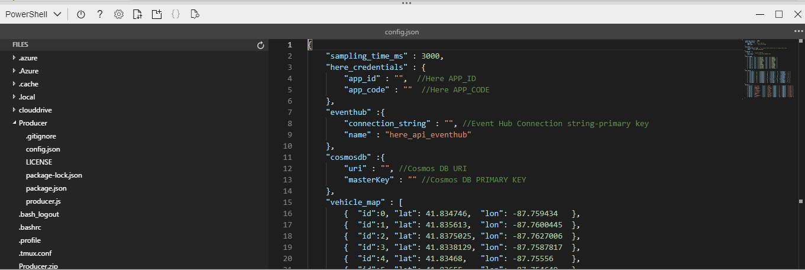

# 2. Data Setup Producer

## Introduction

In this module, you’ll create a data setup for producer to  produce the data and sends Azure Event Hub. Using the provided command-line, you’ll produce the sensor data of Trucks. Lastly, you’ll use the dashboard to plot Trucks on the map and watch their status in real-time. In subsequent modules you’ll add functionality to analyze and persist this data and plot the Line graph dashboard to analyze the various parameter of the Truck in real-time

## Overview

The architecture for this module involves an Event Hub as a producer. Our producer is a sensor attached to a Truck which currently moving on the track. This sensor emits data for every five second including the truck’s current location, Engine Temperature, Engine RPM, Engine Load and Coolant Temperature. Our operations team can monitor these details using the dashboard.

## Implementation

In our previous module we have created Event hub and Cosmos DB. We assume that you have completed the previous module successfully, in this module we are going to FTP the producer script to emits the data on Every Five seconds
  
## 1. Data Setup for Producer

In this step you will download the script files from the link and then you need to do the required configuration to get connect with EventHub. This script files will produce the current location, Engine Temperature, Engine RPM, Engine Load & Coolant Temperature details of the Truck.

<strong>Step-by-step instructions (expand for details)</strong>

 
 1. Click the [link](https://github.com/iyyappan16/AzureHereMap/blob/master/2_Data_Setup_Producer/Producer.zip) and download the zip file (Producer.zip) and save it in to your local machine..

	
1. Open Azure Portal home page and login with your credentials.

	

1. Click on **Cloud shell** to open the Azure PowerShell command-line.

1. Let’s it open the **PowerShell command-line** it may take few seconds to open up

	
	
1. Ensure that the command-line interface indicates its **PowerShell**, by default it will be in the Azure directory. We need to set location to execute our Producer script. Execute the below command to set location

                >Set-Location $home 
	
		
6. It changes the directory and it set’s the home location of the user profile

	
1. In menu tab click on **Upload/Download** files icon then click on upload to upload our zip file 

	
	
1. Browse to the directory where you saved the Zip file locally which you have downloaded in step-1. Choose the file and **Upload**.

	
	
1. Once the upload is completed successfully. The you need to extract the file, for extracting it  use the below command

	            >Expand-Archive “Producer.zip”
         
        
     
  
1. It may take few seconds to extract, after successful extraction you can verify the file by using the below command. 

              >ls
              
1. It lists the directories available in the current directory. so, you can find the unzipped/ extracted **Producer** folder. 
  

## 2. CosmosDB & Event Hub Configuration

In this step you will configure the Event Hub details on the Producer script. The producer will produce the data and sends to the Azure Event Hub to store the data’s in cosmos DB. This script files will produce the current location, Engine Temperature, Engine RPM, Engine Load & Coolant Temperature details of the Truck. 

<strong>Step-by-step instructions (expand for details)</strong>

 
1. Navigate to the **Producer** directory by executing the below command

		>cd Producer

1. In menu tab click on **Open editor** icon, it opens the VS code text editor online

	

1. In the text editor left panel select the **Producer** folder under this find & open **config.json**

	
	
	
1. In **config.json** find the key **here_credentials** and replace the **app_id** & **app_code** with **HERE APP_ID** & **APP_CODE** value which you copied in the module 1.

1. In **config.json** Find the key **eventhub** and replace the **connection_string** with **Event Hub Connection string-primary key** value which you copied in the module 1. 

		
1. In **config.json** Find the key **cosmosdb** and replace the **uri** & **masterKey** with **Cosmos DB URI** & **Cosmos DB PRIMARY KEY** value which you copied in the module 1.
	
1. After making the changes, click on more tab to save the file. Click on more tab on the right corner, click **save** to save the file. Then click on **close editor** to close the window.

	
	
		
1. Now back in to PowerShell execute the below command to validate the producer script. You can see the data’s emitting by the Trucks. By default, it produces five trucks data.

		>node producer.js	
		
	
	
	
1. You can run up to 10 Trucks to emit data. You can mention the number of trucks should run at a time by mentioning in the command line. You can mention from 1 to 10.

		>node producer.js 8

	
	
	
1. Press **ctrl+c** in the keyboard to stop the producer.
	  

