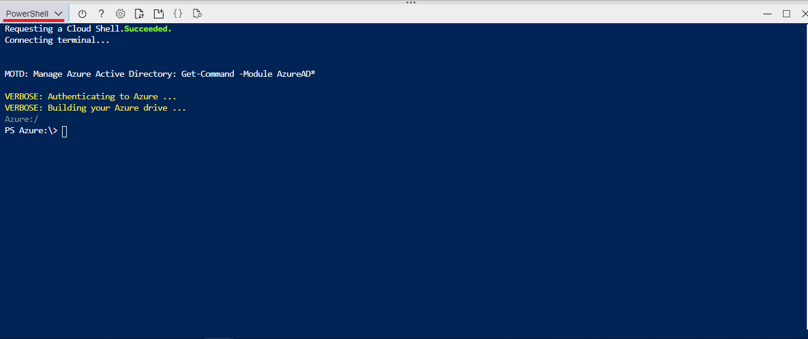
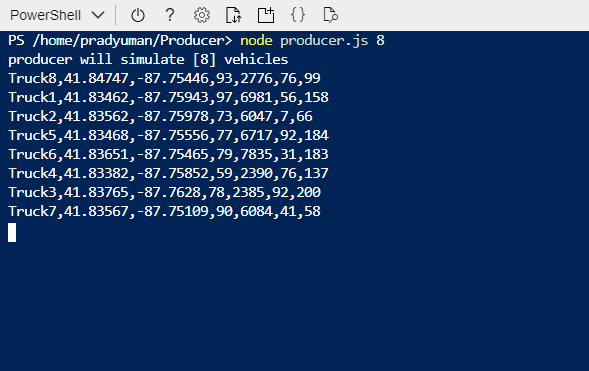
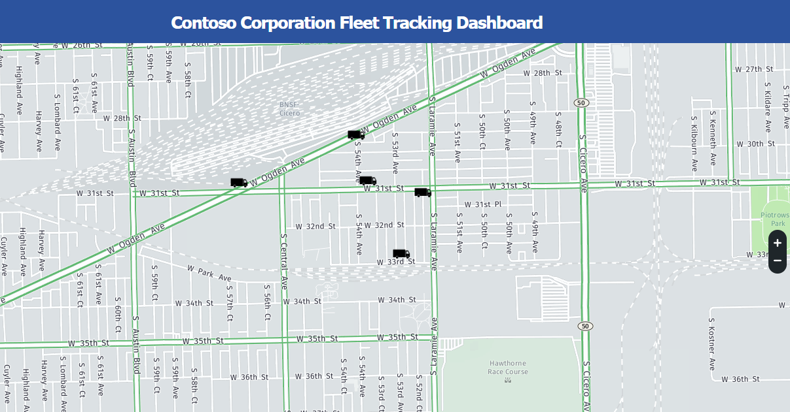
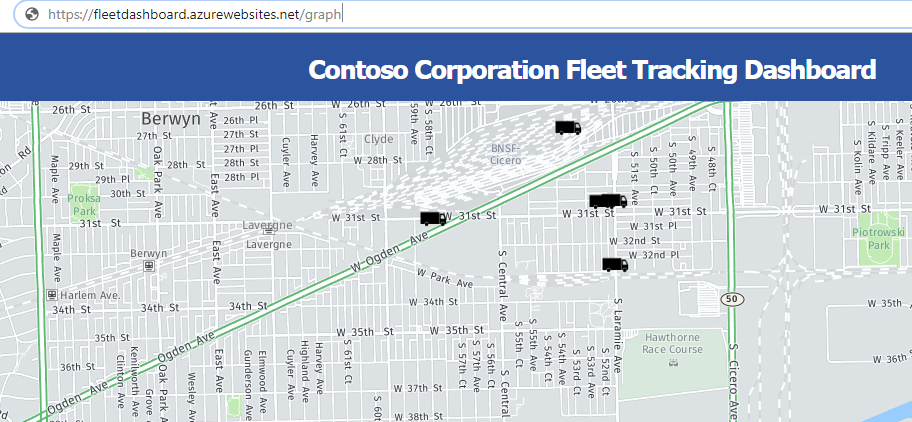
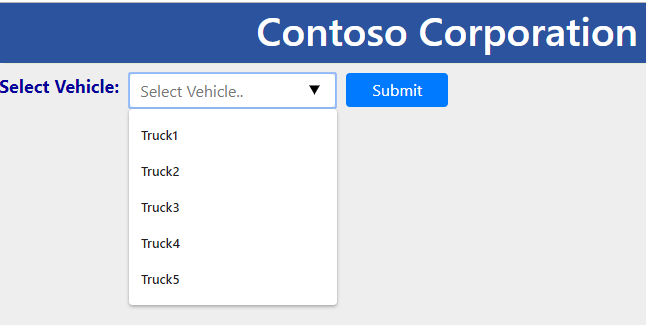
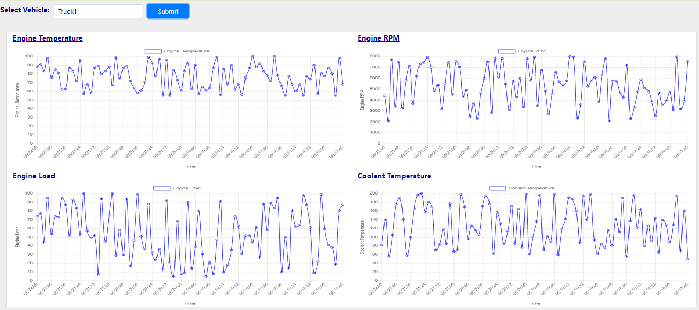
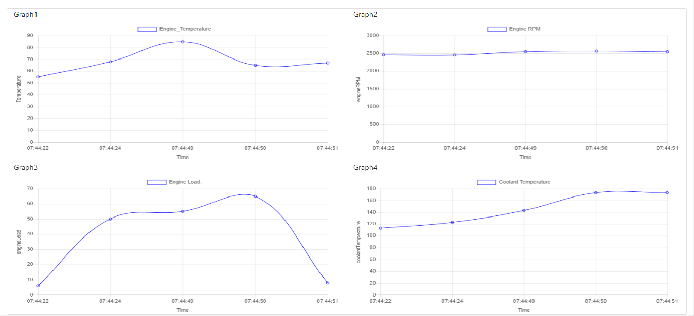

# Implementation Validation 

In this module, you are going to access the Azure Web App to get the dashboard which we created in the previous module. You will be getting the two kinds of dashboard. Trucks on the map dashboard to monitor the truck movement in real time and Line graph dashboard to analyze the parameters of the Truck’s Engine Temperature, Engine RPM, Engine Load and Coolant Temperature.

### Implementation

In our previous modules we have created Web App. We assume that you have completed all the previous modules successfully. In this module you are going to execute the producer, script to produce the data and then you are going to monitor the trucks in dashboard by running the azure web app

## 1. Steps to Execute Producer

<strong>Step-by-step instructions (expand for details)</strong>

 
1. Open Azure Portal home page

1. Click on **Cloud shell** to open the Azure PowerShell command-line.

  	

1. Let’s it open the **PowerShell command-line** it may take few seconds to open up

	
	
1. Ensure that the command-line interface indicates its **PowerShell**, by default it will be in the Azure directory. We need to set location to execute our Producer script. Execute the below command to set location

                >Set-Location $home 
	
		
6. It changes the directory and it set’s the home location of the user profile

1. Navigate to the **Producer** directory by executing the below command 

                >cd Producer
	
  
1. You can run up to 10 Trucks to emit data. You can mention the number of trucks should run at a time by mentioning in the command line. You can mention from 1 to 10.

              	>node index.js 8

	
  
  
 1. Keep this window open and let's producer, script to be running to see the real time truck movement on the map
  

## 2. Steps to Execute Web App

<strong>Step-by-step instructions (expand for details)</strong>

1. Open the browser tab and enter the Web App URL which you copied/saved in the previous module

 		Eg: https://fleetdashboard.azurewebsites.net

1. You can able to see the Map dashboard. Based on your truck count in the producer the Truck icons will be displayed in the Map.

1. Every five seconds you can able to see the movement of the truck

  	

1. To access the Line Graph dashboard, type /graph in the URL and enter

              Eg: https://fleetdashboard.azurewebsites.net/graph
              
    

1. Its open's a new page and you can see a Select Vehicle Text box

    
    
1. Click in textbox, its dropdown the available tuck details

    
    
1. Select the Truck and click on Submit button, it plots the Line graph of Engine Temperature, Engine RPM, Engine Load and Coolant Temperature.

    
    
    
    

  

Congratulations You have completed the Workshop successfully..!
  
After you have completed the workshop you can delete all of the resources that were created by following the [cleanup guide][cleanup].

[cleanup]: ../5_CleanUp/

